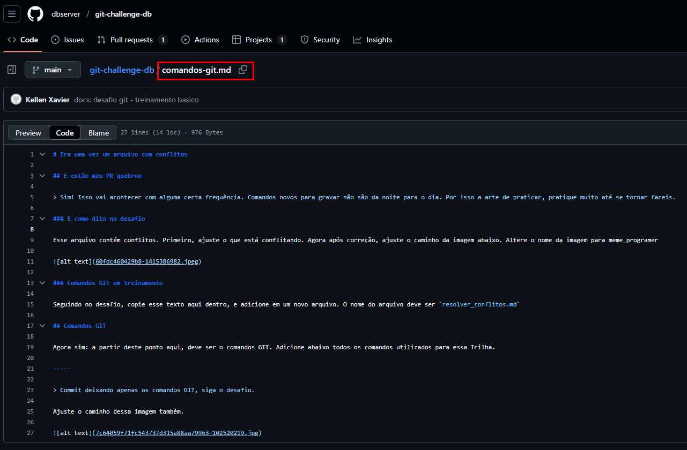
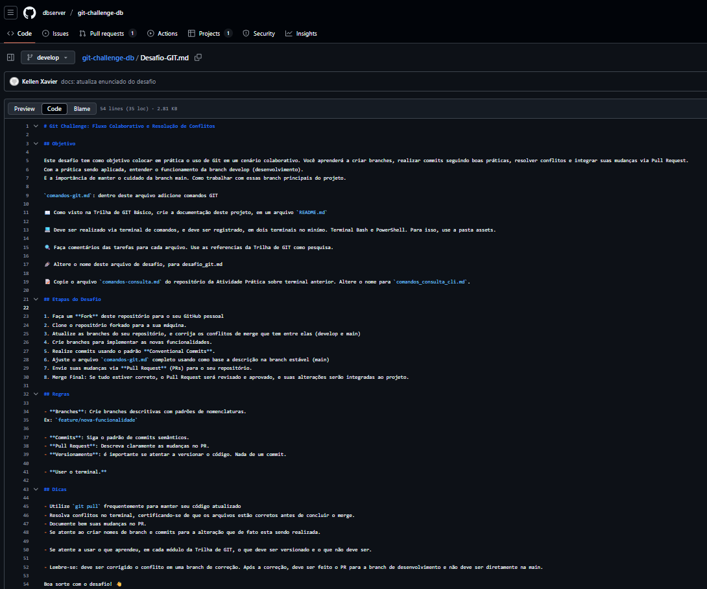
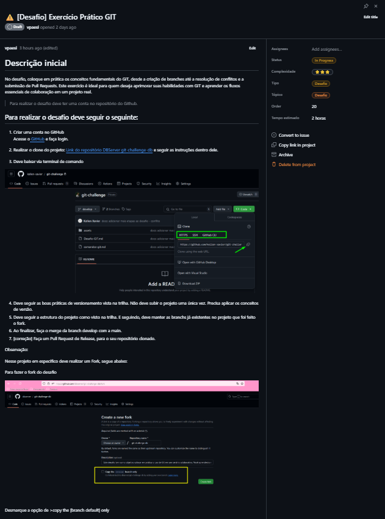
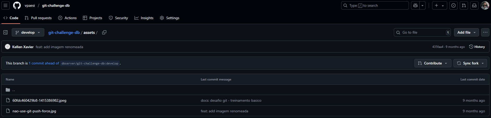
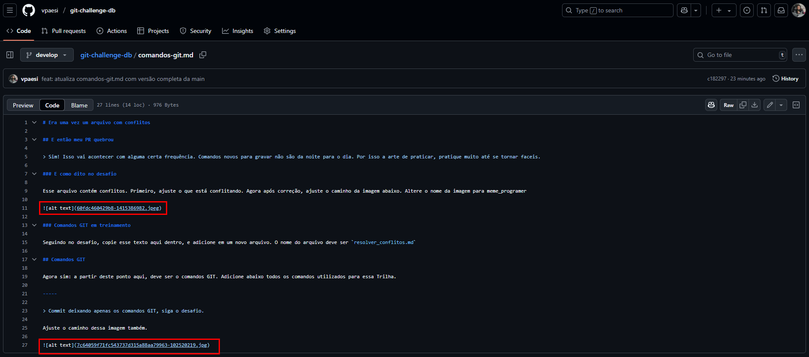
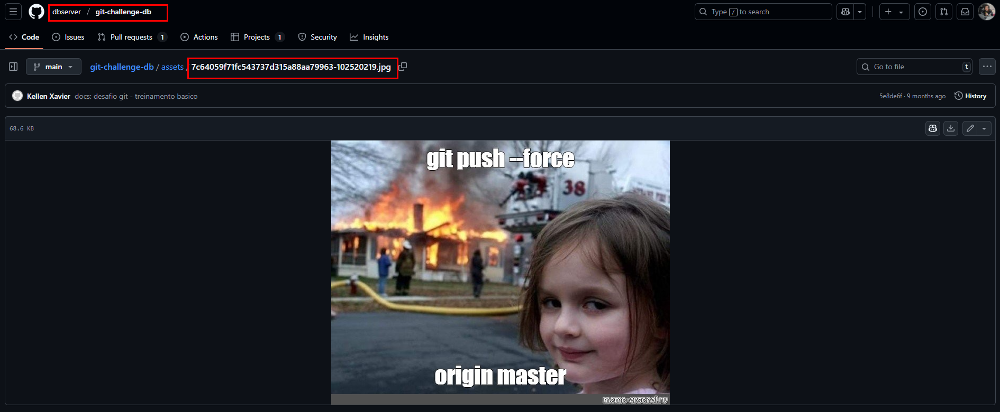

# O Desafio original:

# O outro Desafio original (?):

# O outro outro Desafio original (?):

**Confuso? também achei.** Dessa forma, dividi o desafio em 3 momentos:

## Momento 1 
1. Fazer o fork do repo original.
2. Clonar o repo pra minha máquina.
3. Verificar conflitos:
Nesse momento, tentei verificar conflitos com fetch e pull, e acusava que a develop estava atualizada com a main, mas não era verdade, pois, por exemplo, o arquivo `comandos-git` tinha mais linhas na `main` do que na `develop`, foi aí que, após pesquisar, executei `git checkout main -- comandos-git.md`.

## Momento 2
1. Criar um arquivo de anotações para registrar meu passo a passo pois estava muito confuso. De toda forma, o arquivo de anotação se tornou este aqui mesmo (`README.md`).
2. Recortar as linhas 1 à 12 do arquivo de `comandos-git` e colar em `resolver_conflitos.md`.
3. Manter o arquivo `comandos-git` apenas com a última linha (da imagem com o caminho ajustado), para futuramente inserir todos os comandos GIT utilizados.
4. Ajustar o caminho das imagens:

Nesse momento, percebi que havia duas imagens no repositório:

E duas refernciadas no `comandos-git`:

Contudo, como pode ser visto nos prints, a última imagem referenciada estava com outro nome no repositório que dei fork. Para verificar isso, precisei ir até a main do repositório original para confirmar se a minha suspeita estava certa.

Ou seja, assim como visto no item 3 do Momento 1, essa imagem apesar de conflitante, não apareceu no momento em que busquei por conflitos.

## Momento 3
1. Alterar o nome do arquivo `Desafio-GIT` para `desafio_git.md`, conforme orientado na linha 17 do arquivo em questão (`desafio_git.md`).
2. Copiar o arquivo `comandos-consulta.md` do repositório da Atividade Prática sobre terminal anterior. Altere o nome para `comandos_consulta_cli.md`.

## Momento 4
1. Abrir um PR para mergear a `feat/pratica-desafio` com a `develop`.
