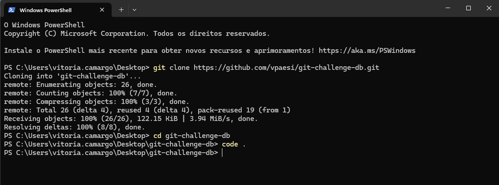
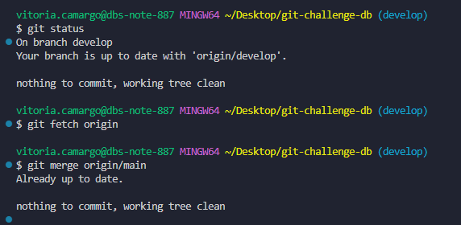
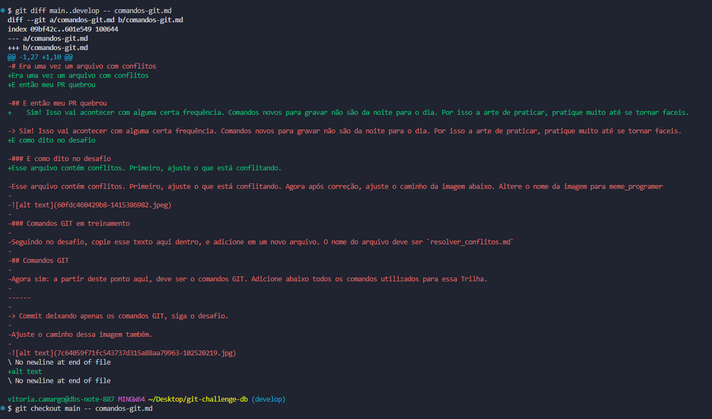

# Comandos GIT

```bash
git clone <url do meu repositório do github> #Pra clonar o repositório localmente que eu já tinha clonado remotamente
git fetch origin #Pra sincronizar com a branch remota
git merge origin/main #Pra mesclar as alterações da branch main remota na sua branch atual
git pull origin main #Pra puxar as alterações da main e verificar se havia conflitos
git diff main..develop -- <nome do arquivo>.<extensão do arquivo> #Pra revisar alterações de um arquivo
git checkout main -- <nome do arquivo>.<extensão do arquivo> #Pra puxar as alterações desse arquivo da main
git checkout -b <nome da branch> #Pra criar uma nova branch
git branch -a #Pra verificar em qual branch eu estava
git add . #Pra adicionar as minhas alterações
git status #Pra verificar se estavam em staged as minhas alterações
git commit -m "<mensagem>" #Pra comitar e escrever do que se trata as alterações
git push origin HEAD #Pra subir as alterações na branch atual
```

## Capturas de telas de alguns comandos executados:

--

--

--


